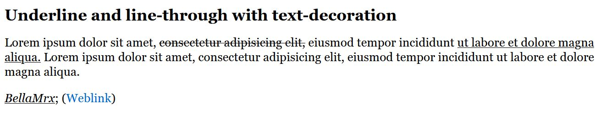
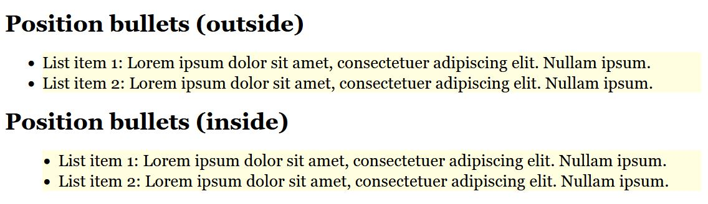
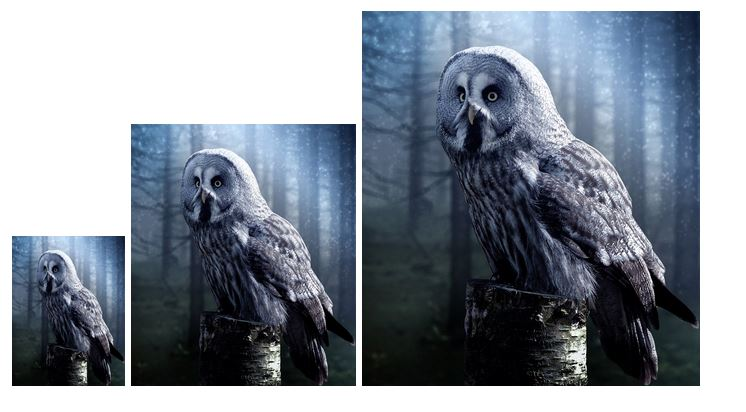

# CSS Guide Part 4

Detailed guide about CSS (all basics for CSS).

Part 4 contains : Styling with CSS, testing and organizing.

The code examples in the guide can be found in the listed folders.

-----------------------------------------------------------------------------------------

## Contents
### [CSS Guide Part I](https://github.com/BellaMrx/CSS_Guide)
1. Introduction to CSS
    - 1.1. History of CSS 
    - 1.2. Principle of CSS application
    - 1.3. Embedding CSS into HTML
    - 1.4. Analyze CSS in the web browser
2. The CSS selectors
    - 2.1. The simple selectors of CSS
    - 2.2. Combinators
3. Inheritance and the cascade 
    - 3.1 The principle of inheritance in CSS
    - 3.2. Understanding the control system of the cascade
    - 3.3. Pass values to CSS properties
### [CSS Guide Part II](https://github.com/BellaMrx/CSS_Guide_Part_2)
4. The box model of CSS 
    - 4.1. The classic box model
    - 4.2. The newer alternative box model of CSS
    - 4.3. Design boxes
    - 4.4. CSS Vendor Prefixes
5. CSS positioning
    - 5.1. Positioning with the CSS property `position`
    - 5.2. Stacking with `z-index`
    - 5.3. Floating boxes with `float`
    - 5.4. Flexible boxes (flexbox model)
### [CSS Guide Part III](https://github.com/BellaMrx/CSS_Guide_Part_3)
6. Responsive layouts with CSS
    - 6.1. Theoretical basic knowledge about responsive web design
    - 6.2. Create a responsive layout
    - 6.3. Responsive layouts with images
    - 6.4. The CSS Grid Layout
    - 6.5. Change the behavior of HTML elements with `display`
    - 6.6. Calculation with CSS and the `calc()` function
### CSS Guide Part IV
7. Styling with CSS
    - 7.1. Text design with CSS
    - 7.2. Design lists with CSS
    - 7.3. Tables with CSS
    - 7.4. Images and graphics with `width` and `height`
    - 7.5. Transfom elements
    - 7.6. Style HTML forms with CSS
8. Testing and organizing
    - 8.1 Validate HTML and CSS
    - 8.2. View websites in different sizes
    - 8.3. Set up central stylesheet
9. Useful websites about CSS

--------------------------------------------------------------------------------------------

# 7. Styling with CSS
Here you can find some more examples to make websites more beautiful or readable.


## 7.1. Text design with CSS
CSS offers a lot of features to design and customize text for websites.


### Select fonts with `font-family`

   ```
    body { font-family: Arial;}
   ```

This puts the *Arial* font between `<body>` and `</body>`. I.e. the whole HTML document uses the font *Arial*. In order to be able to use this font, it must be installed locally on the visitor's system (*Arial* is installed on most computers). However, it is also possible to offer alternative fonts, separated by a comma (*font-stack*).

   ```
    body { font-family: Arial, Calibri, sans-serif; }
   ```

If no font is installed on the computer, the default font of the web browser is used. If a font contains a space, then it must be indicated by quotation marks e.g. `"Courier New"`. To be on the safe side, it is recommended to specify a generic font (e.g. `sans-serif`) at the end.

Overview of generic fonts
| Font Class | Meaning                                                                       | Examples  |
| ---------- | ----------------------------------------------------------------------------- | --------- |
| serif | here are small fine lines or ticks at the end of the letter stroke across the basic direction | Times, Times New Roman, Georgia, Bookman |
| sans-serif | are sans serif fonts, with a straight line at the end of the stroke. | Arial, Helvetica, Lucida, Verdana |
| monospace | are fonts with a fixed width, where all letters have the same width | Andale Mono, Courier, Courier New, Fixed |
| cursive | this font is intended to give the impression of a cursive script | Comic Sans MS, Florence, Parkavenue, Monotype Corsiva |
| fantasy | are often decorative ornamental fonts that can be used for creative purposes | Brushstroke, Impact, Haettenschweiler, Oldtown |

 [Complete Code](https://github.com/BellaMrx/CSS_Guide_Part_4/blob/main/7_StylingWithCSS/Part_1/styles/style.css) --> *7_StylingWithCSS/Part_1/styles/style.css*
   ```
    body {
        font-family: Arial, Verdana, Helvetica, sans-serif;
    }

    .footer, .header {
        background-color: lightyellow;
        border: 1px solid black;
        padding: 2% 2%;
        text-align: center;
        font-family: cursive;
    }

    .article {
        font-family: Georgia, Times, serif;
    }
   ```
 


Analyze font in web browser
 


### Display fonts with web fonts `@font-face`
With `@font-face` it is possible to use fonts that are not installed on the user's computer. The disadvantage is that the loading time is extended.

   ```
    @font-face { 
        font-family: Arial;
        src: url('path/to/font.ttf') format('truetype');
    }
   ```

#### Embed license-free fonts from Google into the website
The fonts from Google Fonts can be found at [Google Fonts](https://fonts.google.com/).

 [Complete Code](https://github.com/BellaMrx/CSS_Guide_Part_4/blob/main/7_StylingWithCSS/Part_2/styles/style.css) --> *7_StylingWithCSS/Part_2/styles/style.css*
   ```
    @import url('https://fonts.googleapis.com/css2?family=Roboto:ital,wght@0,400;0,700;1,400&display=swap');
    body {
        font-family: 'Roboto', sans-serif;
    }
   ```

 


Other license-free and commercial providers of web fonts
- [FontLibrary](http://fontlibrary.org)
- [FontsForWeb](http://fontsforweb.com)


#### Use symbols with icon fonts
There are several providers of icon fonts, one of the most popular is [Font Awesome](https://fontawesome.com/). There you can find a lot of icons that are needed for a website.

First, the CSS file must be included in the HTML document.

   ```
    <link href="styles/all.css" rel="stylesheet">
   ```

Now the font symbols from Font Awesome can be used in the HTML document with the tag `<i>`.

   ```
    <i class="fas fa-home"></i>
   ```

The font size can be adjusted with `font-size`.

   ```
    <i class="fas fa-home" style="font-size:3em;"></i>
   ```

Colors can be changed with `color`.

   ```
    <i class="fas fa-home" style="color:blue;"></i>
   ```

Font Awesome's font icons have special classes that can be used to adjust the icon size with `fa-2x`, `fa-3x`, `fa-4x` and `fa-5x` relative to their container.

   ```
    <i class="fas fa-home fa-2x"></i>
   ```

For symbols with a trademark, the prefix `fab` must be used instead of `fas`. The `b` stands for brand, the `s` in `fas` for solid. 

An overview of Font Awesome's symbols can be found at [Font Awesome - Gallery](https://fontawesome.com/icons?d=gallery). Other interesting information about Font Awesome can be found here [Font Awesome - How to use](https://fontawesome.com/how-to-use/web-fonts-with-css).

 [Complete Code](https://github.com/BellaMrx/CSS_Guide_Part_4/tree/main/7_StylingWithCSS/Part_3) --> *7_StylingWithCSS/Part_3*

 

There are other providers besides Font Awesome:
- [Genericons](http://genericons.com)
- [Icomoon](http://icomoon.io)
- [Fontello](http://fontello.com)
- [Entypo](http://www.entypo.com)


!Note!: Many of these icons and fonts are free, but still have some kind of license , which should be read through before using them on the website.


### Set font size with `font-size`

#### Keywords for font size
CSS provides predefined font size keywords such as `small`, `x-small`, `xx-small`, `medium` (base font size), `large`, `x-large` and `xx-large`. These are absolute values. There are also the keywords `smaller` and `larger`, which are relative values (relative to the parent element). They are rarely used, because the actual font size can only be controlled to a limited extent.


#### Relative font sizes with `em`.
An easy way to adjust the font size for the whole document is to set `font-size` for the *body* element. If `font-size: 1em;` (1em = 100%) is set, the default value of the web browser is used. 
The fact that a relative font size of the *body* element controls the font size for the elements of the web page through inheritance, this option is popular in practice. But it is exactly this inheritance that can make adjusting font sizes a bit more complex if not taken care of.

 [Complete Code](https://github.com/BellaMrx/CSS_Guide_Part_4/blob/main/7_StylingWithCSS/Part_4/styles/styleA.css) --> *7_StylingWithCSS/Part_4/styles/styleA.css*
   ```
    body {
        font-family: Arial, Verdana, Helvetica, sans-serif;
        font-size: 0.95em;
        /* or 95% */
    }

    footer, header {
        background-color: palegreen;
        border: 1px solid black;
        padding: 2% 2%;
        text-align: center;
    }

    article {
        font-family: Georgia, Times, serif;
        font-size: 0.8em;
        /* or 80% */
    }

    p {
        font-size: 0.8em;
        /* or 80% */
    }
   ```

 


#### Set font size with `rem`
The problem with inheritance of relative values that have with font size with `em` no longer occurs with `rem` (=root em). Since it inherits to the highest root element `<html>` instead of the font size of the corresponding parent element.
 
 [Complete Code](https://github.com/BellaMrx/CSS_Guide_Part_4/blob/main/7_StylingWithCSS/Part_4/styles/styleB.css) --> *7_StylingWithCSS/Part_4/styles/styleB.css*
   ```
    html { 
        font-size: 100%; 
    }

    body { 
        font-family: Arial, Verdana, Helvetica, sans-serif;
        font-size: 0.9375rem;
    }

    footer, header {
        background-color: palegreen;
        border: 1px solid black;
        padding: 2% 2%;
        text-align:center;
    }

    article {
        font-family: Georgia, Times, serif;
        font-size: 0.8125rem;  
    }

    p { 
        font-size: 0.8125rem; 
    }
   ```

 


#### Fixed values with `px` and `pt`
With `px` (pixel) you have full control over the text size. Due to the different screen sizes and resolutions, however, e.g. 16px do not look the same everywhere. I.e. with a higher pixel density on an inch the pixels inevitably becomes smaller.
The unit `pt` (point) is more suitable for printing, if a print version is created with CSS.


#### the responsive units `vw` and `vh`
The *viewport units* with `vw` (view width) and `vh` (view height), are relative to the screen dimensions. This assigns a size to an element, which is calculated in relation to the width and height of the viewport. `1vw` corresponds to 1% of the width of the viewport, exactly the same applies to `vh` (corresponds to 1% of the height of the viewport).
Additionally there are the units `vmin` and `vmax`, which refer to the height or width and use the smaller or larger value.
 
 [Complete Code](https://github.com/BellaMrx/CSS_Guide_Part_4/blob/main/7_StylingWithCSS/Part_4/styles/styleD.css) --> *7_StylingWithCSS/Part_4/styles/styleD.css*
   ```
    html { 
        font-size: calc(100% + 0.5vw); 
    }
   ```

 


### Italic and bold fonts with `font-style` and `font-weight`
An italic font can be rendered with the CSS property `font-style` and the value `italic`. If a font does not have an `italic` cut, the web browser will try to italicize it with `oblique`. The default value is `normal`.

The CSS property `font-weight` can be used to define the thickness of the font. The `bold` value defines a bold font style. The default value is `normal`. Besides `bold` there are also the values `bolder` and `lighter`, as well as the numeric values `100`, `200` to `900` (in steps of 100). `400` stands for `normal` and `700` for `bold`.

 [Complete Code](https://github.com/BellaMrx/CSS_Guide_Part_4/blob/main/7_StylingWithCSS/Part_5/styles/style.css) --> *7_StylingWithCSS/Part_5/styles/style.css*
   ```
    .italic {
        font-style: italic;
    }

    .oblique {
        font-style: oblique;
    }

    .normal {
        font-style: normal;
    }

    .weight-normal {
        font-weight: normal;
    }

    .weight-bold {
        font-weight: bold;
    }
   ```

 


### Create small caps with `font-variant`
With `font-variant` and the value `small-caps` the text will be converted to all uppercase, keeping the size of the lowercase letters.

 [Complete Code](https://github.com/BellaMrx/CSS_Guide_Part_4/blob/main/7_StylingWithCSS/Part_6/styles/style.css) --> *7_StylingWithCSS/Part_6/styles/style.css*
   ```
    .cap  { 
        font-variant:small-caps; 
    }

    .vers { 
        text-transform:uppercase;
    }
   ```

 


### Line spacing with `line-height`
The line spacing defines the distance from baseline to baseline and can be set with the CSS property `line-height`. The line spacing is important for the readability of longer text passages.

 [Complete Code](https://github.com/BellaMrx/CSS_Guide_Part_4/blob/main/7_StylingWithCSS/Part_7/styles/style.css) --> *7_StylingWithCSS/Part_7/styles/style.css*
   ```
    .p-75 { 
        line-height: 75%; 
    }

    .p-100 { 
        line-height: 100%; 
    }

    .p-150 { 
        line-height: 150%; 
    }
   ```

 


#### The shorthand with `font`
The CSS property `font` is a shorthand notation for the properties in that order `font-style`, `font-weight`, `font-size/line-height`, and `font-family`.

   ```
    p {
        font: italic normal bold 1.2em/120% Georgia, Times, serif;
    }
   ```


### Letter and word spacing with `letter-spacing` and `word-spacing`
If the spacing between the individual letters is to be changed, this can be done with the CSS property `letter-spacing`. This is not suitable for normal continuous text, because it can worsen the readability. It makes more sense for headlines or texts with capital letters only.
With `word-spacing` you can control the spacing between words. By default the spacing is `0.25em`, but this also depends on the web browser.

 [Complete Code](https://github.com/BellaMrx/CSS_Guide_Part_4/blob/main/7_StylingWithCSS/Part_8/styles/style.css) --> *7_StylingWithCSS/Part_8/styles/style.css*
   ```
    .letterspace { 
        letter-spacing: 0.2em; 
    }

    .wordspace { 
        word-spacing: 0.9em;
    }
   ```

 


### Text alignment with `text-align` 
Important for a good reading flow of texts is the alignment, which can be controlled with the CSS property `text-align`. There are four values for this:
`left` : This aligns the text left, which is usually the default alignment of the web browser. 
`right` : This aligns the text to the right.
`center` : This will center the text, this is good for headings, poems or short texts.
`justify` : This aligns the text in justified text, where the individual lines are of equal width and flush left and right.

 [Complete Code](https://github.com/BellaMrx/CSS_Guide_Part_4/blob/main/7_StylingWithCSS/Part_9/styles/style.css) --> *7_StylingWithCSS/Part_9/styles/style.css*
   ```
    .left { 
        text-align: left; 
    }

    .right { 
        text-align: right; 
    }

    .center { 
        text-align: center; 
    }

    .justify { 
        text-align: justify; 
    }
   ```

 


### Vertical alignment with `vertical-align`
The CSS property `vertical-align` is used for vertical alignment of inline elements and is not suitable for block elements.

 [Complete Code](https://github.com/BellaMrx/CSS_Guide_Part_4/blob/main/7_StylingWithCSS/Part_10/styles/style.css) --> *7_StylingWithCSS/Part_10/styles/style.css*
   ```
    .vtop {
        vertical-align: top;
    }

    .vmiddle {
        vertical-align: middle;
    }

    .vbottom {
        vertical-align: bottom;
    }

    .vsuper {
        vertical-align: super;
    }

    .vsub {
        vertical-align: sub;
    }

    .vsub-05em {
        vertical-align: -0.5em;
    }
   ```

 


### Indent text with `text-indent`
With the CSS property `text-indent` the first line of text can be indented with a positive value or pulled out with a negative value to maintain the reading flow. This is usually used for books and magazines, but not so much for web pages. 

 [Complete Code](https://github.com/BellaMrx/CSS_Guide_Part_4/blob/main/7_StylingWithCSS/Part_11/styles/style.css) --> *7_StylingWithCSS/Part_11/styles/style.css*
   ```
    .p-ident {  
        font-size: 1em;
        text-indent: 1.3em;
    }
   ```

 


### Underline and line-through text with `text-decoration`

 [Complete Code](https://github.com/BellaMrx/CSS_Guide_Part_4/blob/main/7_StylingWithCSS/Part_12/styles/style.css) --> *7_StylingWithCSS/Part_12/styles/style.css*
   ```
    .underline { text-decoration: underline; }

    .a-no-underline { text-decoration: none; }

    .line-through { text-decoration: line-through; }
   ```

 


### Case sensitive text with `text-transform`
With the CSS property `text-transform` and the value `uppercase` the text is displayed in upper case and with `lowercase` in lower case. With `capitalize` only the first letter is displayed as uppercase.

 [Complete Code](https://github.com/BellaMrx/CSS_Guide_Part_4/blob/main/7_StylingWithCSS/Part_13/styles/style.css) --> *7_StylingWithCSS/Part_13/styles/style.css*
   ```
    .uppercase { text-transform: uppercase; }

    .lowercase { text-transform: lowercase; }
   ```

 


### Add a shadow to the text with `text-shadow`

   ```
    text-shadow: 5px    /* Horizontal offset */
                 5px    /* Vertical offset */
                 5px    /* Shadow gradient radius */
                 gray;  /* Shadow color */
   ```

 [Complete Code](https://github.com/BellaMrx/CSS_Guide_Part_4/blob/main/7_StylingWithCSS/Part_14/styles/style.css) --> *7_StylingWithCSS/Part_14/styles/style.css*
   ```
    .shadow-one { 
        text-shadow: 3px 3px 5px gray; 
    }

    .shadow-two { 
        color: lightgray;
        text-shadow: 0px -2px 1px black;
    }

    .shadow-three {
        color: #ff0000b3;
        text-shadow:
            15px -15px 5px yellow,
            -5px 15px 8px orange;
    }
   ```

 


### Split text with `column-count` into several columns
With the CSS property `column-count` it is possible to split a text automatically into a multi-column set. Is very useful for wide screens, and increases the readability of the text. With `column-gap` the gap between the columns is controlled.

 [Complete Code](https://github.com/BellaMrx/CSS_Guide_Part_4/blob/main/7_StylingWithCSS/Part_15/styles/style.css) --> *7_StylingWithCSS/Part_15/styles/style.css*
   ```
    .column {
        column-count: 2;
        column-gap: 1.5rem;
    }
   ```

 


Instead of `column-count` also `column-width` can be used. This will automatically create as many columns depending on this width as they have space in the viewport of the web browser. With the CSS property `columns` there is also a shorthand notation for the two properties `column-width` and `column-count`.

   ```
    .column {
        /*columns: 20em 2;*/
        columns-width: 250px;
        column-gap: 1.5rem;
    }
   ```


## 7.2. Design lists with CSS

### Bullets with `list-style-type`
For ordered lists with `<ul>` the following values are available:
- `none` : no bullets
- `disc` : filled circle, default
- `circle` : empty circle
- `square` : square character

For ordered lists with `<ol>` the following values are available:
- `none` : no numbering
- `decimal` : numbering like 1., 2,. 3. ...
- `decimal-leading-zero` : numbering like 01., 02., 03. ...
- `lower-alpha` and `lower-latin` : numbering like a., b., c. ...
- `upper-alpha` and `upper-latin` : numbering like A., B., C. ...
- `lower-roman` : numbering like i., ii., iii., iv. ...
- `upper-roman` : numbering like I., II., III., IV. ...

 [Complete Code](https://github.com/BellaMrx/CSS_Guide_Part_4/blob/main/7_StylingWithCSS/Part_16/styles/style.css) --> *7_StylingWithCSS/Part_16/styles/style.css*
   ```
    ul { list-style-type: square; }

    ol { list-style-type: upper-roman; }
   ```

 


### Images as bullets with `list-style-image`
With the CSS property `list-style-image` an image can be used as a bullet.

 [Complete Code](https://github.com/BellaMrx/CSS_Guide_Part_4/blob/main/7_StylingWithCSS/Part_17/styles/style.css) --> *7_StylingWithCSS/Part_17/styles/style.css*
   ```
    ul { list-style-image: url("../images/star.png"); }
   ```

 


Instead of an image, a special character can also be used. For this purpose `list-style-type` is set to `none`. And using `li:before` and `content` a special character is used as list symbols.
 
 [Complete Code](https://github.com/BellaMrx/CSS_Guide_Part_4/blob/main/7_StylingWithCSS/Part_18/styles/style.css) --> *7_StylingWithCSS/Part_18/styles/style.css*
   ```
    .specialul { 
        list-style-type: none;
    }

    .specialul li:before { 
        content: '\2023'; color: red; 
        font-size: 20px;
    }
   ```

 

You can find this special character here [HTML Symbols - U2023](https://www.htmlsymbols.xyz/unicode/U+2023). And more you can find here [HTML Symbols](https://www.htmlsymbols.xyz/).


### Position bulleted list with `list-style-position`
With the CSS property `list-style-position` the bullet point can be positioned inside or outside. The default behavior is set with the value `outside`, so the bullet point is located to the left of the text block. With the value `inside` the bullet point is inside the text block. 
 
 [Complete Code](https://github.com/BellaMrx/CSS_Guide_Part_4/blob/main/7_StylingWithCSS/Part_19/styles/style.css) --> *7_StylingWithCSS/Part_19/styles/style.css*
   ```
    .out { list-style-position: outside; }

    .in { list-style-position: inside; }
   ```

 


### Create navigation and menus with lists
The expandable menu for the mobile version was created here with *jQuery*. This is also possible with JavaScript.
 
 [Complete Code](https://github.com/BellaMrx/CSS_Guide_Part_4/tree/main/7_StylingWithCSS/Part_20) --> *7_StylingWithCSS/Part_20*

Desktop-Version

 


Mobile-Version

  


## 7.3. Tables with CSS

 [Complete Code](https://github.com/BellaMrx/CSS_Guide_Part_4/blob/main/7_StylingWithCSS/Part_21/styles/style.css) --> *7_StylingWithCSS/Part_21/styles/style.css*
   ```
    table {
        width: 700px;
    } 

    th {
        padding: 0.5em;
        text-transform: uppercase;
        border-top: 1px solid black;
        border-bottom: 1px solid black;
        text-align: left;
    }

    tr:nth-child(even) { background: lightgray; }

    td:nth-child(1) {
        font-weight: bold;
        width: 100px;
    }

    td { padding: 0.5em; }

    tr:hover {
        background: darkblue;
        color: white;
    }
   ```

 


### Collapsing borders for table cells with `border-collapse`
The CSS property `border-collapse` can be used to specify whether the borders of the individual cells are displayed separately (`border-collapse: seperate;`) or collapsed (`border-collapse: collapse;`).

 [Complete Code](https://github.com/BellaMrx/CSS_Guide_Part_4/tree/main/7_StylingWithCSS/Part_22) --> *7_StylingWithCSS/Part_22*
   ```
    ...
    table {
        width: 700px;
        border: 1px solid black;
        border-collapse: separate;
    }
    ...
   ```

 


### Spacing between cells with `border-spacing`

 [Complete Code](https://github.com/BellaMrx/CSS_Guide_Part_4/tree/main/7_StylingWithCSS/Part_23) --> *7_StylingWithCSS/Part_23*
   ```
    ...
    table {
        width: 700px;
        border: 1px solid black;
        border-spacing: 5px 10px;
    } 
    ...
   ```

 


### Position table caption with `caption-side`
This sets the position of the table caption. Usually it is positioned above the table with `caption-side: top;`. With the value `bottom` it is positioned below the table. 

With `empty-cells: hide;` the frame can be hidden if there is no content. The default value would be `empty-cells: show;`, then the frame is displayed without any content.

 [Complete Code](https://github.com/BellaMrx/CSS_Guide_Part_4/tree/main/7_StylingWithCSS/Part_24) --> *7_StylingWithCSS/Part_24*
   ```
    ...
    table {
        width: 700px;
        empty-cells: hide;
        caption-side: bottom;
        background: lightgray;
    }

    ...

    caption { font-style: italic; text-align: left; padding-top: 5px; }
    ...
   ```

 


## 7.4. Images and graphics with `width` and `height`
The size of the images can be set with the CSS properties `width` and `height`. It is possible to display one and the same image in different sizes. If each ``- tag is assigned a class, it is ralatively easy to display them in different sizes.

 [Complete Code](https://github.com/BellaMrx/CSS_Guide_Part_4/blob/main/7_StylingWithCSS/Part_25/styles/style.css) --> *7_StylingWithCSS/Part_25/styles/style.css*
   ```
    .large {
        width: 225px;
        height: 250px;
    }

    .medium {
        width: 150px;
        height: 175px;
    }

    .small {
        width: 75px;
        height: 100px;
    }
   ```

 


Thus, it is also possible to position the images easily. By adding to the classes, more.

 [Complete Code](https://github.com/BellaMrx/CSS_Guide_Part_4/tree/main/7_StylingWithCSS/Part_26) --> *7_StylingWithCSS/Part_26*
   ```
    ...
    <p>
        Lorem ipsum ...
    </p>
    ...
   ```

   ```
    ...
    .medium {
        width: 150px;
        height: 175px;
    }

    ...

    .align-left {
        float: left;
        margin: 0 0.6em 0.3em 0;
    }
    ...
   ```

 


## 7.5. Transfom elements 
With the help of the CSS property `transform` it is possible to change the position of HTML elements. Possible are: a movement with `translate()`, an enlargement or reduction with `scale()`, a rotation with `rotate()`, tilting of elements with `skew()` and a distortion with `matrix()`.

### `transform: scale();`

 [Complete Code](https://github.com/BellaMrx/CSS_Guide_Part_4/blob/main/7_StylingWithCSS/Part_27/index.html) --> *7_StylingWithCSS/Part_27/index.html*
   ```
    ...
    <ul>
        <li>
            
        </li>
        <li>
            
        </li>
        ...    
    </ul>
    ...
   ```

 [Complete Code](https://github.com/BellaMrx/CSS_Guide_Part_4/blob/main/7_StylingWithCSS/Part_27/styles/styleA.css) --> *7_StylingWithCSS/Part_27/styles/styleA.css*
   ```
    ...
    img:hover {
        transform: scale(1.25);
        border: 4px white solid;
    }
    ...
   ```

In this example with `scale(1.25)`, the images are enlarged by a factor of 1.25 as soon as the mouse pointer passes over them (`hover`). The factor `scale(1.0)` would have no effect.

 


### `transform: rotate();`
With `rotate()` the element is rotated by a specified number of degrees. With `transform: rotate(15deg);` the element is rotated by 15 degrees, clockwise. A negative value rotates the element counterclockwise.

 [Complete Code](https://github.com/BellaMrx/CSS_Guide_Part_4/blob/main/7_StylingWithCSS/Part_27/styles/styleB.css) --> *7_StylingWithCSS/Part_27/styles/styleB.css*
   ```
    ...
    img:hover {
        transform: rotate(15deg);
        border: 4px white solid;
    }
    ...
   ```

 


### `transform: skew();`
The `skew()` function can be used to tilt an HTML element around the x and y axis. Here two values are given in degrees. The first value gives the tilt around the x-axis and the second gives the tilt around the y-axis.

 [Complete Code](https://github.com/BellaMrx/CSS_Guide_Part_4/blob/main/7_StylingWithCSS/Part_27/styles/styleC.css) --> *7_StylingWithCSS/Part_27/styles/styleC.css*
   ```
    ...
    img:hover {
        transform: skew(5deg, 10deg);
        border: 4px white solid;
    }
    ...
   ```

 

If an HTML element should only be tilted around the x or y axis, this can be done with `skewX()` or `skewY()`.


### `transform: translate();`
With the function `translate()` HTML elements can be moved. Here also two values are needed to want to move the element along the x- and y-axis.

 [Complete Code](https://github.com/BellaMrx/CSS_Guide_Part_4/blob/main/7_StylingWithCSS/Part_27/styles/styleD.css) --> *7_StylingWithCSS/Part_27/styles/styleD.css*
   ```
    ...
    img:hover {
        transform: translate(30px, 20px);
        border: 4px white solid;
    }
    ...
   ```

 


### Combination of transformations
It is possible to combine several functions with each other. For this purpose, the functions must only be separated from each other with a space.

   ```
    ...
    img:hover {
        transform: scale(1.25) rotate(10deg);
    }
    ...
   ```


### Transitions with CSS
When using `transform` the transition can be a bit unattractive, because the e.g. the graphic is immediately scaled large and rotated. This abrupt transition can be softened with the CSS property `transition`.

 [Complete Code](https://github.com/BellaMrx/CSS_Guide_Part_4/blob/main/7_StylingWithCSS/Part_27/styles/styleE.css) --> *7_StylingWithCSS/Part_27/styles/styleE.css*
   ```
    ...
    img {
        max-height: 100%;
        min-width: 100%;
        object-fit: cover;
        vertical-align: bottom;
        transition: all 1s ease;
    }

    img:hover {
        transform: scale(1.25) rotate(10deg);
        border: 4px white solid;
        transition: all 1s ease;
    }
    ...
   ```

`transition` is a shorthand notation, from the following properties:
- `transition-property` : This specifies the property to animate during the transition. `all` specifies that all properties will be animated. There you can also use e.g. `background` to animate.
- `transition-duration` : This specifies the duration of the transition in seconds e.g. `1s`.
- `transition-timing-function` : This specification is a kind of temporal course of the transition. For example, `ease` means that the transition starts slowly, speeds up in the middle and ends slowly again. Other time courses are: `linear`, `ease-in`, `ease-out`, `ease-in-out`.

Some demonstrations and examples of `transition` can be found on this website [CSS Transitions](http://css3.bradshawenterprises.com/transitions/).


### Transform other HTML elements
The transform functions are not limited to images or graphics, it is also possible to use them for other HTML elements.

 [Complete Code](https://github.com/BellaMrx/CSS_Guide_Part_4/blob/main/7_StylingWithCSS/Part_28/index.html) --> *7_StylingWithCSS/Part_28/index.html*
   ```
    ...
    <article class="trans1">
      <h1>Transform elements with CSS</h1>
      <p>Lorem ipsum dolor ...</p>
    </article>
    ...
   ```

 [Complete Code](https://github.com/BellaMrx/CSS_Guide_Part_4/blob/main/7_StylingWithCSS/Part_28/styles/style.css) --> *7_StylingWithCSS/Part_28/styles/style.css*
   ```
    ...
    .trans1  {
        transform: skew(5deg, -4deg);
        border: 0.5em solid blue;
        font-family: Courier;
    }

    .trans2  {
        transform: skew(-4deg, 3deg);
        border: 0.5em solid green;
        font-family: Times;
        z-index: 1;
    }

    .trans3  {
        transform: rotate(180deg) skew(4deg, -2deg);
        border: 0.5em solid red;
        font-family: Arial;
    }

   ```

 


### 7.6. Style HTML forms with CSS
CSS now offers many possibilities for designing forms. Despite the many possibilities should be aware that a form is real functional elements of a website, and when designing it should be careful to keep these elements recognizable as what it is (less is more). A form is usually used to submit entered data to the web server via a web browser.

 [Complete Code](https://github.com/BellaMrx/CSS_Guide_Part_4/blob/main/7_StylingWithCSS/Part_29/index.html) --> *7_StylingWithCSS/Part_29/index.html*
   ```
    ...
    <h1>Contact form</h1>
    <form id="myForm" method="post">
        <fieldset>
            <div>
                <label for="name">Last name:</label>
                <input type="text" name="name" id="name" placeholder="Your last name">
            </div>
            <div>
                <label for="fname">First name:</label>
                <input type="text" name="fname" id="fname" placeholder="Your first name">
            </div>
            <div>
                <label for="mail">E-Mail:</label>
                <input type="email" name="mail" id="mail" placeholder="Email address" required>
                <label for="mail"></label>
            </div>
            <div>
                <label for="born">Year of birth:</label>
                <input type="number" name="born" id="born" min="1920" max="2023" value="1980">
            </div>
            <div class="form_radio">
                <label>Sex:</label>
                <input type="radio" name="sex" id="male" value="male" class="nobreak">
                <label for="male" class="nobreak">Male</label>
                <input type="radio" name="sex" id="female" value="female" class="nobreak">
                <label for="female" class="nobreak">Female</label>
            </div>
            <div>
                <label for="message">Your message:</label>
                <textarea name="message" id="message" placeholder="Enter message here..." rows="8" required></textarea>
                <label for="message"></label>
            </div>
            <div>
                <input type="checkbox" name="reply" id="reply" value="reply" class="nobreak" required>
                <label for="reply" class="nobreak">GDPR consent (<a href="#">Privacy policy</a>)</label>
            </div>
            <div>
                <input name="submit" type="submit" value="Submit" class="nobreak">
                <input name="Reset" type="reset" value="Reset" class="nobreak">
            </div>
            <p>(⨉) = Input required</p>
        </fieldset>
    </form>
    ...
   ```

 [Complete Code](https://github.com/BellaMrx/CSS_Guide_Part_4/blob/main/7_StylingWithCSS/Part_29/styles/style.css) --> *7_StylingWithCSS/Part_29/styles/style.css*
   ```
    ...

    /* Styling */

    fieldset {
        width: 90%;
        padding-top: 1.5em;
        padding-left: 1.5em;
        background: #f0f0f0;
    }

    input:hover, textarea:hover {
        background: #fffff0;
        border: 2px solid #73e4d5;
        box-shadow: 0 0 10px #00000033;
    }

    input[type="submit"]:hover, input[type="reset"]:hover {
        background: #c9c9c9;
        border: 2px solid #6c6c6c;
    }

    input[type="submit"]:active, input[type="reset"]:active {
        background: #8f8f8f;
    }

    input:required+label::after {
        color: red;
        content: " ⨉";
    }

    textarea:required+label::after {
        color: red;
        content: " ⨉";
    }

    input[type='email']:valid+label::after {
        color: green;
        content: " ✓";
    }

    textarea:valid+label::after {
        color: green;
        content: " ✓";
    }

    input[type='checkbox']:valid+label::after {
        color: green;
        content: " ✓";
    }

    /* Single column wrap at 640 pixels */

    @media screen and (max-width: 40em) {
        label:not(.nobreak) {
            display: block;
        }
        label {
            padding-bottom: 0.4em;
        }
        input:not(.nobreak) {
            display: block;
        }
        input[type="checkbox"],
        input[type="submit"],
        input[type="radio"] {
            margin-left: 0;
        }
    }
   ```

 

The indication of the privacy policy is mandatory in EU countries.


-----------------------------------------------------------------------------------------------

# 8. Testing and organizing
CSS and HTML are in constant development, and not every web browser can handle all new features right away. And since there are more and more different devices and therefore different screen sizes, testing created websites is worthwhile.

## 8.1 Validate HTML and CSS
The first in testing should be validation. Many web browsers, editors and development environments already offer functions or plug-ins that take care of validation. Otherwise, the W3C with its online validator for HTML [W3C - Markup Validation Service](https://validator.w3.org/) and for CSS [W3C - CSS Validation Service](https://jigsaw.w3.org/css-validator/) can be used.

 

 


However, a valid website does not mean that it is perfect at the same time. It does not improve reliability, speed and operation, but it is a tool for quality assurance.


### Most used web browsers
When testing, you should also ask yourself which web browsers are most used to test the website. It is possible to look at statistics, which browser is used more or less. An overview of this can be found on the websites [W3Counter](http://www.w3counter.com/trends), [statcounter](http://gs.statcounter.com/) or [statista](https://www.statista.com/). 

 

Such statistics should not be generalized too much, because e.g. articles for Apple are mainly used with *Safari*.


### CSS web browser test
There are various test systems on the web for testing the capabilities of the web browser for CSS. The advantage is that already during the development of the website it can be weighed up whether a new CSS feature should be used in the website at all or whether a fallback must be set up for certain web browsers. A special test for CSS properties can be performed on the website [The CSS3 Test](http://css3test.com). The current web browsers currently manage something like 50% to 67%, which is not bad. The results for the individual areas are listed there.

 


### HTML5 web browser test
To check what the web browser can do regarding HTML, it is possible to test here [HTML5 Test](https://html5test.com).


### Use it or not?
It is not easy to keep track of the different web technologies and what can be used with which web browser. That's what the web database [HTML5 Test](www.caniuse.com) is for. There you can check the latest CSS and HTML features.

 


### Function query with the `@supports` rule
Whether a certain CSS property is supported by a web browser can also be checked with the CSS rule `@supports` (CSS Feature Queries).

An example:

   ```
    ...
    @supports ( hyphens: auto) {
        p {
            text-align: justify;
            hyphens: auto;
        }
    }
    ...
   ```

Here `@supports` is used to check whether the web browser understands the `hyphens: auto` property (`hyphens` = automatic hyphenation of the web browser). If this is the case, then the text in the p elements is justified with `justify` and the CSS property is set to `auto`.


## 8.2. View websites in different sizes
For viewing websites in different sizes there are a lot of online tools, the web browser itself offers this or also plug-ins from development environments. There are also websites that offer this, e.g. the [Viewport Resizer](http://lab.maltewassermann.com/) or [Blisk](https://blisk.io/).

Viewport Resizer

 


## 8.3. Set up central stylesheet
If websites are very large, it is recommended to use several style sheets when developing the website e.g. one stylesheet for the layout and one for the navigation and more. This is clearer during the development of the website. 
So a central stylesheet is used, which is included as usual with the *link* -element in the HTML document. However, this centarle stylesheet does not contain any ordinary CSS content, but only loads the other CSS files using the `@import` rule.

An example:

   ```
   /* Basic design */
    @import url("layout.css");

   /* Navigation */
    @import url("navi.css");

   /* Print version */
    @import url("print.css");

   ```

In practice, it is recommended to put the CSS files in an extra directory, e.g. "styles", for clarity on large websites.

After the development of the website, the CSS files should be merged again. Because the disadvantage of multiple individual CSS files is that multiple server requests are necessary, which can significantly increase the loading time of the website.

To reduce the file size of the CSS file even more and thus improve the loading time, all unnecessary lines of code with spaces, line breaks and comments can be removed. Also for this there are online tools like [CSS Compressor](https://cssminifier.com) or [YUI Compressor](http://refresh-sf.com/). A backup should be made beforehand, because after CSS compression the CSS file is no longer pleasant to read or edit.

There are also development tools with which such an effort can be avoided e.g. [Grunt](http://gruntjs.com) or [Gulp](https://gulpjs.com/).

------------------------------------------------------------------------------------------------

# 9. Useful websites about CSS
## Designing
 * [Design Resources For Developers](https://github.com/bradtraversy/design-resources-for-developers)

 * [HTML Color Codes](https://htmlcolorcodes.com/) 
 * [Ultimate CSS Gradient Generator](https://www.colorzilla.com/gradient-editor/) 
 * [Glassmorphism CSS](https://css.glass/)
 * [Font Awesome](https://fontawesome.com/) 
 * [HTML Symbols](https://www.htmlsymbols.xyz/) 
 
## Learning
 * [W3school](https://www.w3schools.com/)
 * [freeCodeCamp](https://www.freecodecamp.org/) 
 * [CSS-Tricks](https://css-tricks.com/)
 * [Mmdn](https://developer.mozilla.org/en-US/) 
 * [Google](https://www.google.com/)
 * [GitHub](https://github.com/) 


------------------------------------------------------------------------------------------------

This is the end of CSS Guide. This guide is an overview that a web developer should know. There is much more to know about CSS and always new things to learn.

The other parts you can find here:
- [CSS Guide Part I](https://github.com/BellaMrx/CSS_Guide).
- [CSS Guide Part II](https://github.com/BellaMrx/CSS_Guide_Part_2).
- [CSS Guide Part III](https://github.com/BellaMrx/CSS_Guide_Part_3).

On my Twitter account [@bella_mrx](https://twitter.com/bella_mrx) you can find more useful stuff about HTML and web development. 

Or check out my [GitHub](https://github.com/BellaMrx) profile.


Thanks for reading. 
I hope you enjoyed it or at least learned something.